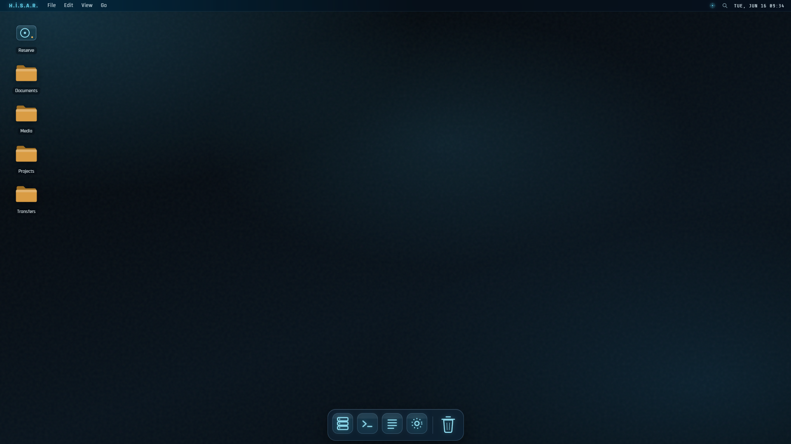

<div align="center">

# H.İ.S.A.R. 

**H**ızlı **İ**letişim **S**aklama ve **A**ktarım **R**ezervi — *Rapid Communication Storage & Transfer Reserve*

A self-hosted, web-based file-transfer system with a full **macOS-style desktop** front end, dressed in the **SPEDA Mark VI** fluid-glass (JARVIS) interface.


</div>

---

## Overview

H.İ.S.A.R. lets a single owner log in and manage files inside a sandboxed directory on a server, through a browser interface that behaves like a desktop operating system — menubar, dock, draggable windows, a Finder, Quick Look, and Spotlight.

This repository contains **both halves**: the desktop client (React + Vite) and the **FastAPI backend** (`server/`) that sandboxes a real directory on the server. It also mounts **Google Drive** as a folder inside the desktop, so the vault and Drive are browsed through the same Finder.

> **Note** — this is a personal, single-user system. There is no public sign-up and no multi-tenant logic by design.

## Screenshots

<div align="center">



</div>

Both **dark** (default) and **light** appearances ship; toggle via the **View** menu or the Appearance icon in the dock.

## Features

**Desktop environment**
- Menubar with working dropdown menus, an arc-reactor system indicator, Spotlight glyph, and a live monospace clock.
- A magnifying **dock** with running-app indicators, launch bounce, and tooltips.
- **Snap-to-grid desktop icons** (Windows-style) that stay draggable and reflow without overlapping.
- macOS-style **lock-screen login**.

**Windowing**
- Multiple **Finder** windows with focus / z-order, dragging, 8-way resize, **zoom/maximize**, and **minimize-to-dock** (restore from a dock chip).
- A lightweight **TextEdit** viewer for text files.

**File management** *(live, against the server)*
- Grid and list views, breadcrumb navigation, sidebar favorites.
- Multi-select via ⌘/Ctrl-click, ⇧-click ranges, **rubber-band drag**, and ⌘A.
- New folder, rename, delete-to-Trash, download, and **drag-and-drop upload with a progress bar**.
- **Quick Look** (Space) with real image, video, PDF and text previews, and **Spotlight** fuzzy search (⌘Space).
- **Google Drive** mounted at `/Google Drive` — browse, upload, rename, and trash Drive files alongside vault files.

**Design**
- The **SPEDA Mark VI** fluid-glass FUI: petrol-void background with drifting ambient pools, cyan primary accent, amber for folders / selection / timestamps, liquid-glass surfaces, and Rajdhani + Share Tech Mono typography.
- No movie-prop clutter — no grids, brackets, ticks, or scanlines.

## Keyboard shortcuts

| Shortcut | Action |
| --- | --- |
| `⌘ / Ctrl + Space` | Open Spotlight |
| `⌘ / Ctrl + N` | New Finder window |
| `Space` | Quick Look the selection |
| `Enter` | Open the selection |
| `⌘ / Ctrl + A` | Select all |
| `Delete` / `Backspace` | Move selection to Trash |
| `← → ↑ ↓` | Move selection |
| `Esc` | Close menu / Quick Look / Spotlight |

## Tech stack

- **React 18** (function components + hooks, no external state or UI libraries)
- **Vite 5** for dev server and bundling
- **FastAPI** + **uvicorn**, Argon2 password hashing, PyJWT sessions
- **httpx** against the Google Drive v3 REST API
- A single self-contained component (`hisar.jsx`) with an injected stylesheet — no CSS framework
- Hand-built SVG icon set; web fonts: Rajdhani, Share Tech Mono

## Getting started

### Prerequisites

- **Node.js 18+** and npm
- **Python 3.11+**

### Run the backend

```bash
python -m venv .venv && source .venv/bin/activate
pip install -r requirements-dev.txt

export HISAR_SANDBOX_ROOT=./vault
export HISAR_OWNER_PASSWORD_HASH="$(python -m server.auth hash-password)"
export HISAR_JWT_SECRET="$(openssl rand -base64 48)"
export HISAR_COOKIE_SECURE=false          # local HTTP only

uvicorn server.main:app --reload --port 8600
```

The vault skeleton (`Documents/`, `Transfers/`, `SPEDA/`, `Forge/`, …) is
created on first start.

### Run the client

```bash
npm install
npm run dev
```

Vite proxies `/auth`, `/files`, `/drive` and `/deposit` to port 8600, so the
session cookie behaves exactly as it does in production. Open the URL Vite
prints and log in with the password you hashed above.

### Build & serve as one

```bash
npm run build                  # → dist/
HISAR_STATIC_DIR=./dist uvicorn server.main:app --port 8600
```

The API serves the built client at `/`, which is how it runs in production.

### Tests

```bash
pytest -q                      # path sandbox + full HTTP surface
```

### Docker

```bash
docker compose -f deploy/docker-compose.yml up --build
```

See [`deploy/README.md`](deploy/README.md) for the production deployment at
`hisar.spedatox.systems` (DNS, Caddy, Forge placement, Google Cloud setup).

## Architecture

```
hisar-mk1/
├── index.html          # Vite entry
├── main.jsx            # React mount
├── hisar.jsx           # The desktop client (component + styles)
├── api.js              # The only place the client talks to the server
├── server/
│   ├── main.py         # App factory, auth routes, Drive OAuth, static hosting
│   ├── paths.py        # THE path-sandbox chokepoint (unit-tested first)
│   ├── auth.py         # Owner JWT + machine token, scope enforcement
│   ├── vault.py        # Local filesystem operations
│   ├── drive.py        # Google Drive as a virtual folder
│   ├── files.py        # The file routes, dispatching vault vs. Drive
│   └── config.py       # Environment-driven settings
├── tests/              # Sandbox + HTTP surface tests
└── deploy/             # Compose file and deployment guide
```

## API

| Method | Endpoint | Auth | Purpose |
| --- | --- | --- | --- |
| `POST` | `/auth/login` | password | Owner login → JWT in an httpOnly cookie |
| `POST` | `/auth/logout` | — | Clear the session |
| `GET` | `/auth/me` | owner | Resume an existing session |
| `GET` | `/files/list?path=` | owner | Listing with size, mtime, kind |
| `POST` | `/files/upload?path=` | owner **or** machine | Streamed multipart upload |
| `GET` | `/files/download?path=` | owner | Streamed, with Range support |
| `DELETE` | `/files/delete?path=` | owner | Moves to `.trash/` — recoverable |
| `POST` | `/files/mkdir` | owner or machine | |
| `POST` | `/files/rename` | owner | Within-sandbox rename |
| `GET` | `/files/usage` | owner | Disk usage |
| `POST` | `/deposit` | **machine only** | The agent / Forge door |
| `GET` | `/drive/status` · `/drive/connect` · `POST /drive/disconnect` | owner | Google Drive OAuth |
| `GET` | `/health` | none | Uptime checks |

### Two credentials, two scopes

- **Owner JWT** — full CRUD, short-lived, httpOnly cookie, rate-limited login
  backed by an Argon2 password hash.
- **Machine token** (`X-Hisar-Token`) — for SPEDA agents and Forge. **Write-only**,
  and only under `/SPEDA` and `/Forge`. It cannot read, list, download, rename,
  or delete anything, and `/deposit` never overwrites (it suffixes `-2`, `-3`…).

Every path from either credential resolves through one function,
`server/paths.py::resolve()`, which does a `realpath` containment check against
`SANDBOX_ROOT` — rejecting `..` traversal *and* symlinks pointing out of the
vault. It is the most attacked surface in the system and is tested first.

## Google Drive

Drive is mounted as a virtual folder at `/Google Drive`. The backend holds the
OAuth refresh token (never the browser), resolves Drive's ID-based model into
paths, streams uploads resumably, and exports Google-native Docs/Sheets/Slides
to Office formats on download. Google Drive is optional — with no credentials
configured, the mount simply never appears.

Set `HISAR_GOOGLE_CLIENT_ID` / `HISAR_GOOGLE_CLIENT_SECRET`, then connect from
the **H.İ.S.A.R. menu → Connect Google Drive…**. Setup steps are in
[`deploy/README.md`](deploy/README.md).

## Roadmap

- [x] Wire file operations to the FastAPI backend (JWT auth, real listings)
- [x] Real upload/download with progress
- [x] Google Drive as a mounted folder
- [ ] Share links — signed, expiring URLs for devices that never log in
- [ ] Upload-only guest drop zone
- [ ] Restore-from-Trash and an Empty Trash action
- [ ] Persist desktop icon layout and window positions server-side
- [ ] Mobile / touch layout

## License

© 2026 spedatox. All rights reserved.

---

<
